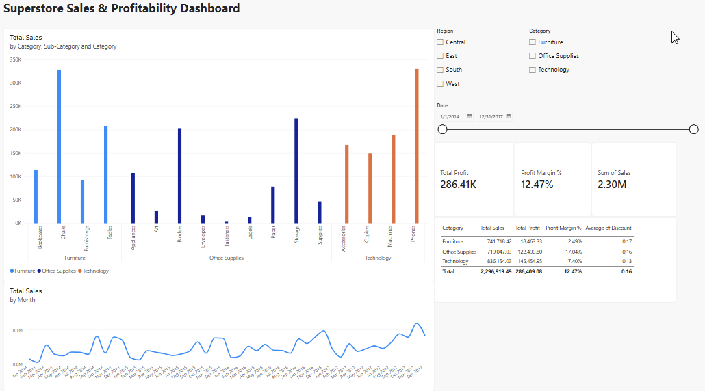
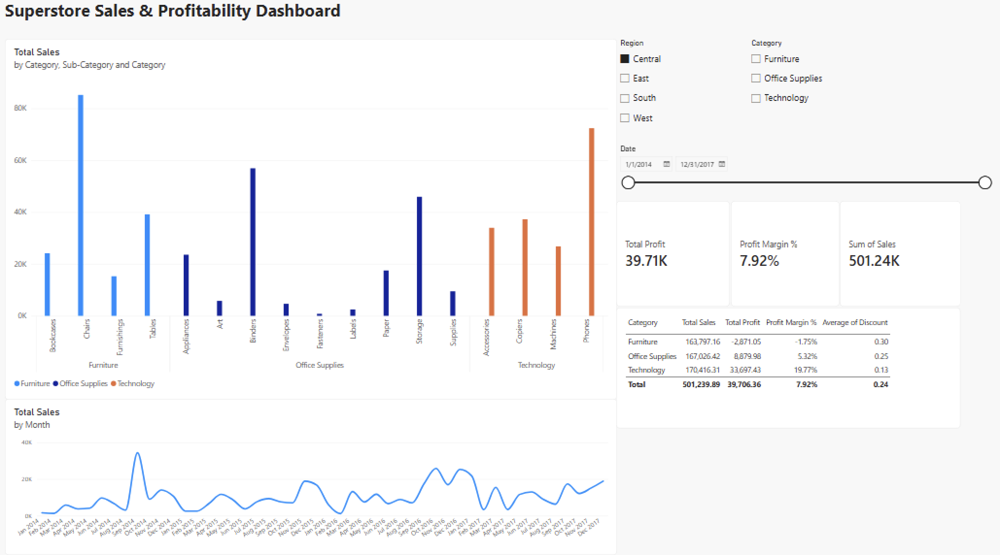

# Superstore Sales & Profitability Dashboard

**Power BI | Excel | Data Visualization | SQL | Data Cleaning**

## Key Finding

Furniture generates similar revenue to Office Supplies and Technology (~$740K each), but only a **2.49% profit margin** — compared to 17%+ for the other two categories. This isn't explained by heavier discounting (Furniture's average discount is close to Office Supplies'). Removing Furniture entirely would raise the company's overall profit margin from **12.47% to 17.23%**. In the Central region specifically, Furniture is actually unprofitable (**-1.75% margin**, a $2,871 loss).

**Recommendation:** Investigate Furniture's cost structure and pricing policy, starting with the Central region.

## Deeper Look: Central Region

Filtering the dashboard to the Central region shows the problem clearly: Furniture is the only category operating at a loss there.

| Category | Sales | Profit | Margin |
|---|---|---|---|
| Furniture | $163,797 | -$2,871 | -1.75% |
| Office Supplies | $167,026 | $8,880 | 5.32% |
| Technology | $170,416 | $33,697 | 19.77% |

Discounting doesn't explain the gap (Furniture's average discount, 17%, is close to Office Supplies' 16%). This points to a structural issue — likely higher product or shipping costs — rather than pricing promotions.

## Tools & Process

- **Power BI** — data modeling, DAX measures, interactive dashboard
- **Excel** — independent cross-verification of totals (Power Query, pivot tables)
- **Data cleaning** — identified and removed 1 duplicate row, verified date logic, checked for spelling inconsistencies across all columns (full dataset profiled, not just a preview)
- **Data source:** [Sample Superstore dataset](https://www.kaggle.com/datasets/vivek468/superstore-dataset-final) (Kaggle)

## Skills Demonstrated

Power BI · Excel · Data Visualization · Data Cleaning · DAX · Business Analysis
